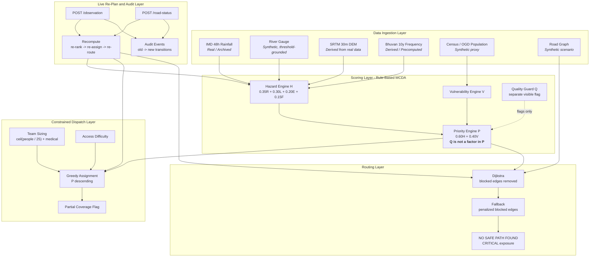

# RAIC - Rapid Assessment & Incident Control
### Ward-Level Disaster Risk Prioritization & Response Planning System
**Team_044 | IBM BOB National Hackathon 2026 | Problem Statement 1**

Transform disaster management from reactive chaos into structured, transparent, auditable intelligence by fusing heterogeneous hazard data with vulnerability, criticality, and data-confidence signals into a resource-constrained, human-authorized rescue dispatch plan.

RAIC is a **decision-support system**, not a forecast engine. It ranks wards, sizes teams, assigns responders under capacity constraints, routes around hazard-flagged corridors, and re-plans live when new field evidence arrives - with an audit trail for every change.

---

## 1. Table of Contents

- [2. What RAIC Is & Is Not](#2-what-raic-is--is-not)
- [3. System Architecture (Mermaid)](#3-system-architecture-mermaid)
- [4. End-to-End Operational Workflow (Mermaid)](#4-end-to-end-operational-workflow-mermaid)
- [5. Live Re-Plan Sequence (Mermaid)](#5-live-re-plan-sequence-mermaid)
- [6. Technology Stack](#6-technology-stack)
- [7. Repository Structure](#7-repository-structure)
- [8. Data Provenance Table (Mandatory)](#8-data-provenance-table-mandatory)
- [9. Mathematical Formulations](#9-mathematical-formulations)
- [10. API Contract](#10-api-contract)
- [11. Explicit Non-Goals (Mandatory Disclosures)](#11-explicit-non-goals-mandatory-disclosures)
- [12. Installation & Quick Start](#12-installation--quick-start)
- [13. Judge Demo Sequence](#13-judge-demo-sequence)
- [14. Security & Operational Notes](#14-security--operational-notes)
- [15. Anticipated Judge Questions](#15-anticipated-judge-questions)

---

## 2. What RAIC Is & Is Not

| RAIC **is** | RAIC **is not** |
|---|---|
| A ward-level decision-support engine | A flood predictor |
| A resource-constrained team assignment planner | A replacement for Google Flood Hub / IMD / SACHET |
| A hazard-aware, cost-minimizing router on a synthetic road graph | A drone-detection product |
| An auditable live re-planning system | An autonomous dispatch platform |
| A transparent, hardcoded MCDA pipeline | A learned or adaptive model |
| Human-in-the-loop by design | A source of fabricated impact numbers |

---

## 3. System Architecture (Mermaid)



---

## 4. End-to-End Operational Workflow (Mermaid)

```mermaid
flowchart LR
    A["Raw data<br/>rain, river, DEM, history, census, graph"] --> B
    B["Hazard H<br/>0.35R + 0.30L + 0.20E + 0.15F"] --> C
    C["Vulnerability V<br/>population, elderly, infrastructure, roads"] --> D
    D["Quality Q<br/>freshness and completeness flag"] --> E
    E["Priority P<br/>0.60H + 0.40V<br/>Q remains separate"] --> F
    F["Team sizing<br/>ceil(people / 25) + medical"] --> G
    G["Access difficulty<br/>routing and assignment constraint"] --> H
    H["Greedy assignment<br/>partial coverage when capacity is short"] --> I
    I["Hazard-aware routing<br/>Dijkstra, then penalized fallback"] --> J
    J["Control room output<br/>priority, access, route, audit"] --> K
    K["Field evidence<br/>POST /observation or /road-status"] -. "recompute" .-> B
```



---

## 5. Live Re-Plan Sequence (Mermaid)

```mermaid
sequenceDiagram
    autonumber
    participant O as Control Room Officer
    participant UI as RAIC Dashboard
    participant API as FastAPI Engine
    participant SS as Scoring Services
    participant RT as Routing Service
    participant AU as Audit Events

    O->>UI: Submit field observation or road update
    UI->>API: POST protected mutation endpoint
    API->>SS: Update in-memory scenario state
    SS->>SS: Recompute V and P; keep Q separate
    SS->>RT: Recompute assignment and route
    RT-->>API: New route and accessibility state
    API->>AU: Append typed audit event
    AU-->>UI: old value -> new value and reason
    UI-->>O: Re-ranked list, assignments, route, audit
```

---

## 6. Technology Stack

| Layer | Technology | Role |
|---|---|---|
| **Backend API** | FastAPI (Python 3.11+) | REST endpoints, dependency injection, schema validation |
| **Validation** | Pydantic v2 | Bounded fields and enumerated inputs |
| **Numerical** | Pure Python + `math` | Deterministic MCDA and team sizing |
| **Frontend** | React 18 + Vite | Officer command dashboard |
| **Mapping** | Leaflet + OpenStreetMap tiles | Ward and route visualization |
| **Auth** | `X-API-Key` header | Guards the two mutating endpoints |
| **Rate limiting** | slowapi | 30 requests/minute on mutating endpoints |
| **Testing** | pytest + httpx | Formula, deduplication, assignment, routing, and API tests |
| **Data format** | JSON | Cached local scenario data |

### Design Principles
- **Deterministic MCDA** - every score is reproducible from inputs.
- **Glass-box** - factor breakdowns and weights are visible.
- **Confidence is a flag, not a multiplier** - Q never suppresses priority.
- **Human-in-the-loop** - outputs are recommendations, not autonomous dispatch.
- **Single recompute pipeline** - live updates use the same scoring path.

---

## 7. Repository Structure

```
team_044/
├── backend/
│   ├── main.py
│   ├── auth.py
│   ├── models/schemas.py
│   ├── services/
│   │   ├── hazard_service.py
│   │   ├── vulnerability_service.py
│   │   ├── priority_service.py
│   │   ├── routing_service.py
│   │   ├── observation_service.py
│   │   └── road_status_service.py
│   ├── data/
│   ├── tests/
│   ├── requirements.txt
│   └── requirements-dev.txt
├── frontend/
├── .env.example
└── README.md
```

---

## 8. Data Provenance Table (Mandatory)

| Field | Label | Source |
|---|---|---|
| `rainfall_24h_mm`, `rainfall_forecast_48h_mm` | Real/archived | IMD daily rainfall, National Water Data Portal - one real historical heavy-monsoon day used for the demo |
| `elevation_m`, `low_elevation_susceptibility` | Derived from real data | SRTM 30m DEM, computed per ward centroid |
| `historical_flood_count_10y` | Derived/precomputed | Bhuvan National Flood Vulnerability Index or NDEM |
| `river_level_m` | Synthetic, threshold-grounded | Simulated values anchored to the documented Ganga-at-Patna danger level (48.6m) |
| `population_at_risk` | Synthetic proxy from real district data | District/block-level Census/OGD population distributed across the eight synthetic wards; not ward-census accurate |
| `road_status`, `road_graph.json` | Synthetic scenario | Hand-built small graph, not real road-network data |
| `image_ref` | Sample image | Not a real drone feed |

**Named-but-not-integrated dataset stack:** Bhuvan Spatial Flood Early Warning, NDEM, NASA GDIS, Copernicus EMS, USGS Earthquake, and NOAA Natural Hazards are schema-compatible future extensions, not live integrations in this prototype.

---

## 9. Mathematical Formulations

### Hazard Index - H in [0, 100]
```
H_flood = 0.35*R + 0.30*L + 0.20*E + 0.15*F
```
- **R** - normalized recent plus forecast rainfall.
- **L** - river level divided by danger level, capped at 1.2, then min-max normalized.
- **E** - low-elevation susceptibility contribution.
- **F** - historical 10-year flood frequency, min-max normalized.

> **UI label:** *Normalized Hazard Index - decision support only, not a probability of flooding.*

> **Judge-proofing condition:** Ward 7 ranks near the top without being the rainiest, driven by river stage, low elevation, and historical frequency.

### Vulnerability - V
```
V = population_norm + elderly_disabled_norm
    + hospital_school_proximity + road_criticality
```

### Quality Guard - Q
```
Q = f(data_freshness, source_completeness)
if Q < threshold: verification_flag = "VERIFY IMMEDIATELY"
```
Q is displayed independently and never multiplies into priority.

### Priority - P
```
P = 0.60*H_norm + 0.40*V_norm
P_display = round(100 * P, 1)
```
`access_difficulty` is a routing and assignment constraint, not a priority term.

### Routing Edge Cost
```
edge_cost = base_travel_time + lambda * max(H_j for j in exposed_wards)
            + heavy penalty if blocked
```
The implemented illustrative hazard weight is `lambda = 1.0`.

---

## 10. API Contract

| Method | Endpoint | Purpose |
|---|---|---|
| `GET` | `/scenario` | Current wards and road-edge snapshot |
| `GET` | `/hazard` | Hazard index per ward with factor breakdown |
| `GET` | `/priorities` | Vulnerability, confidence, priority, and verification flags |
| `GET` | `/assignments` | Team allocation, sizing, and partial-coverage status |
| `GET` | `/route/{team_id}/{ward_id}` | Hazard-aware route, status, and exposure |
| `POST` | `/observation` | Ward-level field evidence |
| `POST` | `/road-status` | Edge-level blocked/open state change |

### Authentication
`GET` endpoints are public. Both mutating endpoints require:

```text
X-API-Key: dev-only-key-change-me
```

Set `RESPONSE_API_KEY` in the environment to override the demo key. Set `DATA_DIR` to point the backend at another local dataset directory.

### `POST /observation` request
```json
{
  "ward_id": "W5",
  "timestamp": "2026-09-12T10:00:00Z",
  "detected_people_count": 35,
  "confidence": 0.72,
  "source_type": "manual_entry",
  "image_ref": null
}
```

Input bounds include `detected_people_count` from 0 to 500000, confidence from 0 to 1, ward IDs matching `^W\d+$`, and the two supported source types. Repeating the same ward, timestamp, and source type is deduplicated.

### `POST /road-status` request
```json
{
  "edge_id": "E12",
  "status": "blocked",
  "timestamp": "2026-09-12T10:05:00Z",
  "source_type": "manual_entry"
}
```

### Audit event shapes
Both mutation responses include their existing typed audit event with old-to-new values and a reason. Authentication and rate limiting do not change response bodies.

---

## 11. Explicit Non-Goals (Mandatory Disclosures)

- Not competing with Google Flood Hub / IMD on forecast accuracy.
- Not claiming real drone hardware or operational-grade aerial detection - observation input works manually; a pretrained detector is optional enrichment.
- Not claiming live integration for the named-but-not-integrated sources above.
- Not claiming "safest/fastest" - claiming **hazard-aware, cost-minimizing** routing on a synthetic graph.
- Not claiming full offline resilience - the backend uses cached local data; the frontend map may still require network access.
- Not fabricating any lives-saved, response-time-%, or efficiency-% figure, ever.
- Not autonomously dispatching - every output is human-authorized decision support.
- Team-size ratio, route-cost weight, and Q threshold are illustrative constants, not empirically calibrated.
- `population_at_risk` is a district-data-derived proxy, not ward-level census data.
- Not a predictive system, not a learning system - weights are hardcoded defaults, not trained or adapted over time.
- No civilian evacuation routing is implemented - only rescue-team assignment and routing.

---

## 12. Installation & Quick Start

### Prerequisites
- Python 3.11+
- Node.js 18+ for the frontend
- Modern browser

### Backend
```bash
cd backend
python -m venv venv
# Windows: venv\\Scripts\\activate
# macOS/Linux: source venv/bin/activate
pip install -r requirements.txt -r requirements-dev.txt
python -m uvicorn main:app --reload --host 0.0.0.0 --port 8000
```
- API root: `http://localhost:8000`
- Swagger: `http://localhost:8000/docs`

### Frontend
```bash
cd frontend
npm install
npm run dev
```
- Control Room UI: `http://localhost:3000`

### Run tests
```bash
cd backend
pytest -q
```
The suite currently contains 14 tests covering hazard normalization, priority arithmetic and Q isolation, team sizing, partial coverage, deduplication, routing fallback, and API behavior.

### Environment
Copy `.env.example` values into the backend process environment when needed:

```text
RESPONSE_API_KEY=dev-only-key-change-me
DATA_DIR=./data
```

---

## 13. Judge Demo Sequence

| Beat | What to Show | Endpoint / UI |
|---|---|---|
| 1 | Hazard table; click Ward 7, a non-rainiest high-risk ward; show factor breakdown | `GET /hazard` |
| 2 | Vulnerability contrast between wards | `GET /priorities` |
| 3 | Ward 3 `VERIFY IMMEDIATELY` confidence flag | `GET /priorities` |
| 4 | Ranked list, team sizing, and a `PARTIAL` coverage row | `GET /assignments` |
| 5 | Route display and a road-status update | `GET /route/...`, `POST /road-status` |
| 6 | Manual observation and live priority/team update | `POST /observation` |
| 7 | Audit event feed showing the re-plan transition | Dashboard |

---

## 14. Security & Operational Notes

- **Auth:** `X-API-Key` is required on both mutating endpoints; read endpoints remain public by design.
- **Rate limiting:** slowapi limits `POST /observation` and `POST /road-status` to 30 requests per minute per remote address.
- **Input validation:** Pydantic bounds counts, confidence, IDs, source types, and road status values.
- **No database, no SQL:** state is held in process memory and local JSON data.
- **No live external API calls at inference:** scoring and routing use local scenario data.
- **Audit events:** mutation responses retain the typed observation and road-status event shapes.
- **Frontend fallback:** when map tiles are unavailable, the dashboard can fall back to tabular views.

---

## 15. Anticipated Judge Questions

| Question | Answer |
|---|---|
| *Isn't this just Google Flood Hub / SACHET?* | Those forecast and alert at district level. RAIC ranks, sizes, assigns, and routes at ward level with visible confidence. |
| *Is this data real?* | See Section 8: rainfall, elevation, and historical inputs are real or derived; river level, population, and roads are disclosed as synthetic or proxy. |
| *Why not multiply by confidence?* | A low-confidence, poorly monitored ward could be high-risk. RAIC flags it for verification instead of silently deprioritizing it. |
| *Did you use a real drone?* | No. Manual observation entry is the guaranteed path; sample-image enrichment is optional. |
| *Is this the safest / fastest route?* | No. It is a hazard-aware, cost-minimizing route on a synthetic graph. |
| *What if no path exists?* | The system exposes a `NO SAFE PATH FOUND` state and critical exposure warning rather than silently dropping the route. |
| *How many lives would this save?* | No fabricated number. The demo shows changed resource-allocation order and live re-planning. |
| *Is it predictive or does it learn?* | No. It is rule-based MCDA with hardcoded, disclosed illustrative weights. |

---

Auth, rate limiting, and field validation were added to the two evidence-ingestion endpoints because a live re-plan loop exposed to unauthenticated writes is a liability, not a demo. Scoring and routing reads remain public.

*RAIC - Rapid Assessment & Incident Control. Decision support only. Every output is human-authorized.*